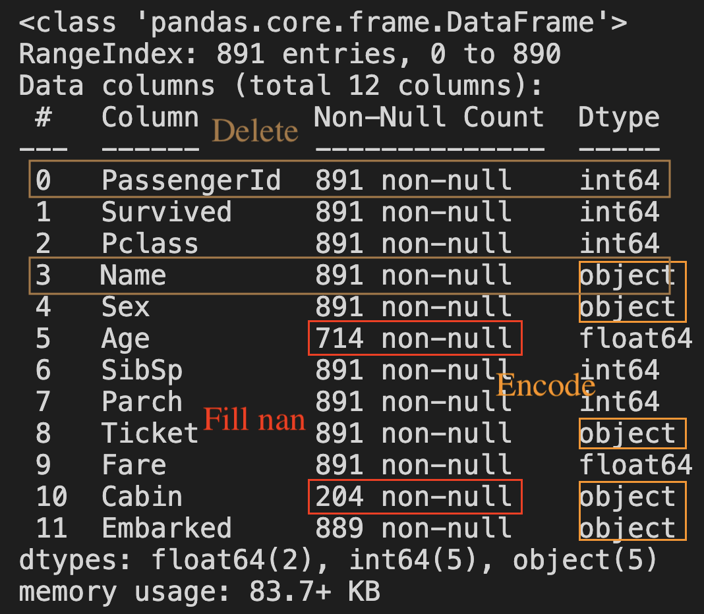
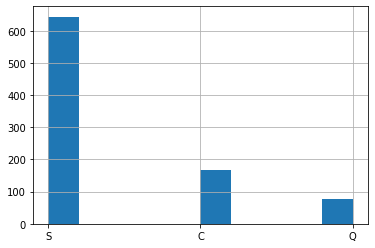

# Hw04
## 解題步驟：
1. 讀取 titanic.csv
2. 刪除無用特徵('PassengerId', 'Name', 'Cabin', 'Ticket')
3. 分析缺失值，練習繪製直方圖(如下圖二)
4. 分別以平均值及眾數填補
5. 將剩下是字串的欄位轉為數值(Age and Embarked)
6. 將資料切分為訓練及測試集 (4 : 1)
7. 輸入隨機森林訓練並測試模型在訓練及測試集上的準確度

圖一：

圖二：

## Hint:

1. [如何分析分類結果效能？ classification_report](https://scikit-learn.org/stable/modules/generated/sklearn.metrics.classification_report.html)
2. [隨機森林簡單調參](https://zhuanlan.zhihu.com/p/126288078)
3. [別人怎麼特徵工程的？](https://yulongtsai.medium.com/https-medium-com-yulongtsai-titanic-top3-8e64741cc11f)

## 檔案解說：

1. feature_engineering.ipynb:
   * 紀錄上課關於特徵工程的教學
4. HW_04.ipynb:
   * 同學需撰寫的程式作業
5. HW_04_ans.ipynb:
   * 作業的正確答案
6. data_description.md
   * 關於特徵的講解
7. ./titanic.csv:
   * 同學寫作業時須讀取的檔案