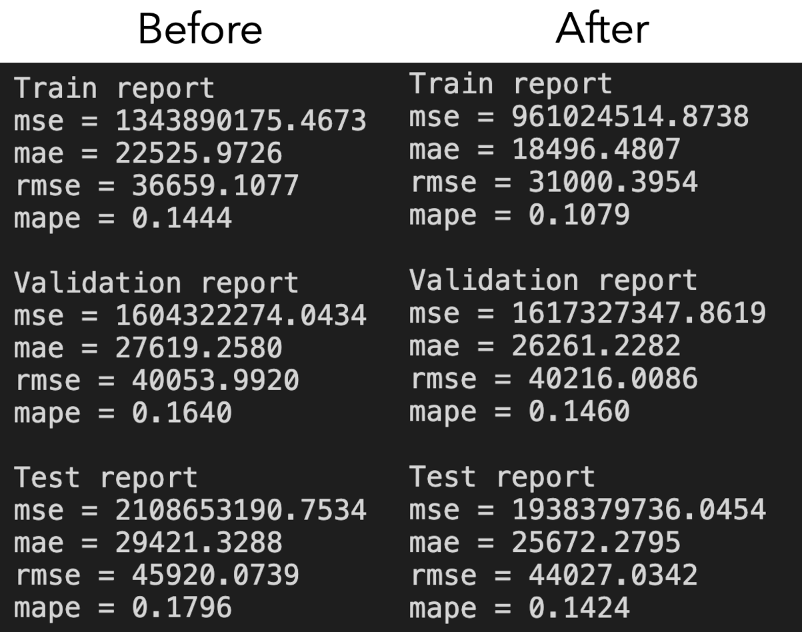

# Hw05
## 解題步驟：
1. ## 解題步驟：

   1. 讀取 x_train.npy, y_train.npy, x_test.npy, y_test.npy
   2. 將 training dataset 再切分為 training set, validation set (圖一)
   3. 先以上課的知識調整出一個不會 over-fitting 太多的決策樹模型
   4. 以 validation set 作為調整參數的基準，陸續調整其他參數 (請同學測試看看 validation 要佔多少比例，後續的調整會比較客觀)
   5. 將最終調整結果與一開始的決策樹做比較，誤差是否有降低
   6. 同學若也懂其他模型的知識也可以試試看一樣的做法比較看看
      

   #### 圖一 (Train, Validation and Test)
   

   #### 圖二 (是我前後調整的結果)
   

## 檔案解說：

1. feature_engineering.ipynb:
   * 紀錄上課關於特徵工程的教學
4. HW_05.ipynb:
   * 同學需撰寫的程式作業
5. HW_05_ans.ipynb:
   * 作業的正確答案
6. data_description.md
   * 關於特徵的講解
5. *.npy: 同學需要讀取的訓練及測試資料